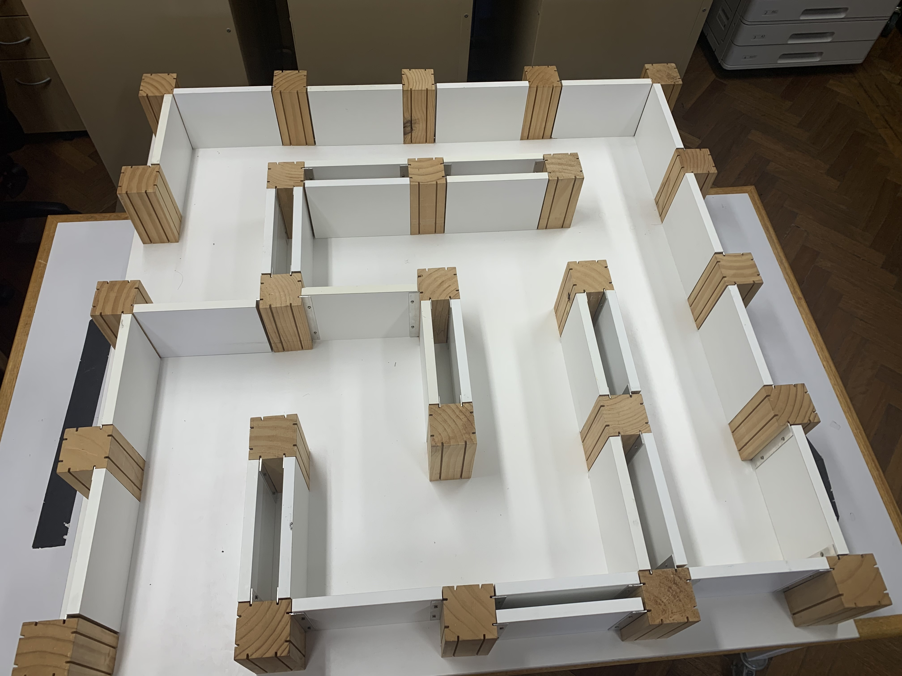
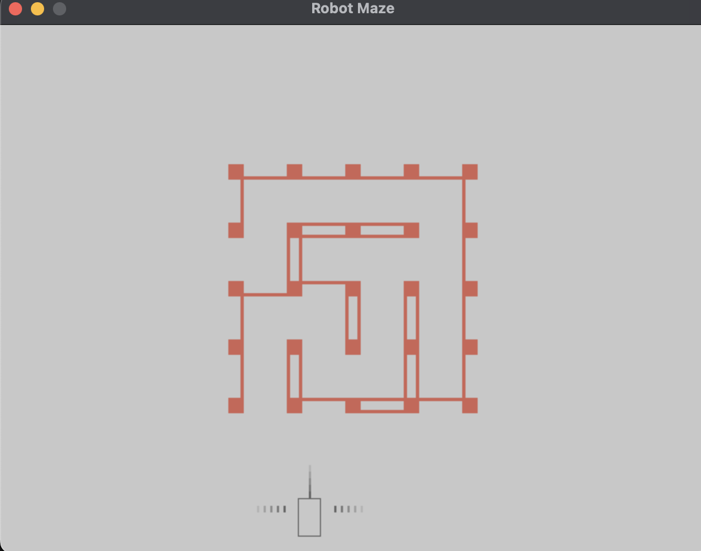

## What had changed

main.c on SETUP MAZE section had been changed (don't touch any of it)

structures.h BLOCK_SIZE, WALL_WIDTH, and WALL_HEIGHT had been added
ROBOT_WIDTH and ROBOT_HEIGHT had been changed
Those value are matching the real world where 5mm = 1px

maze_hori.txt and maze_verti.txt had been added to config the real maze

The code will not run if maze_hori.txt and maze_verti.txt is not exist
or BLOCK_SIZE, WALL_WIDTH, and WALL_HEIGHT constant in structures.h is not exist.

## What can be config

BLOCK_SIZE, WALL_WIDTH, and WALL_HEIGHT value can be change (if you want to, but not recommend)

The layout of the maze can be change by modify maze_hori.txt or maze_verti.txt

### How to config maze_hori.txt or maze_verti.txt

Those file contains binary number where
0 = no wall
1 = had wall

maze_hori.txt need to have 10 row and 4 column 
think about when you put the wall horizontally on the maze

maze_verti.txt need to have 4 row and 10 column 
think about when you put the wall vertically on the maze

(idk how to explain it properly, just try see this image and those text inside maze_hori.txt or maze_verti.txt, they are the same pattern)

(Please see text file for comparison)

# How to run code

If you are on Mac M1 simply just type
`bash main.sh`

But if you use other os then just search canvas ᗜˬᗜ 